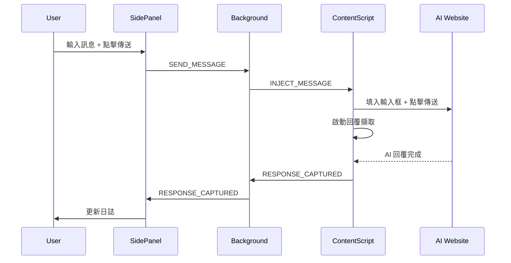
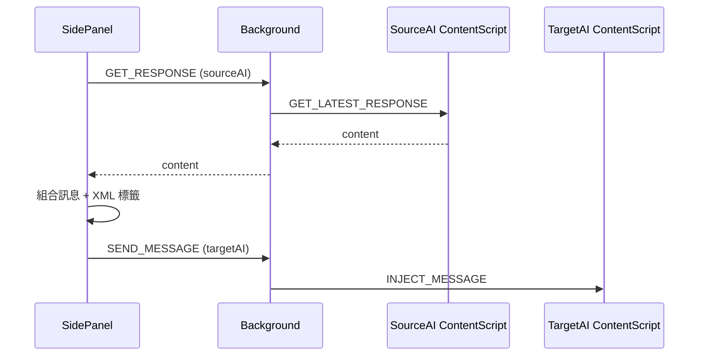

# AI 圓桌 (AI Roundtable) 技術規格文件

> 版本：0.2.0 | 最後更新：2026-01-25

---

## 1. 概述

### 1.1 專案簡介

AI 圓桌是一款 Chrome 擴充功能，允許使用者同時操控多個 AI 平台（Claude、ChatGPT、Gemini），實現 AI 之間的圓桌討論、交叉評價和深度協作。

### 1.2 核心目標

> **同一個問題，讓多個模型同時回答並互相辯論，用分歧與衝突逼出漏洞、拓展思路。**

### 1.3 設計原則

| 原則 | 說明 |
|------|------|
| 本機執行 | 不上傳任何資料至外部伺服器 |
| 網頁操作 | 直接操作 AI 平台網頁介面，不使用 API |
| 實驗性質 | 專注驗證「圓桌式思考流程」的價值 |

---

## 2. 技術架構

### 2.1 技術堆疊

- **平台**：Chrome Extension (Manifest V3)
- **語言**：JavaScript (ES6+)
- **介面**：HTML5 + CSS3
- **儲存**：chrome.storage.local / chrome.storage.session

### 2.2 檔案結構

```
ai-roundtable/
├── manifest.json           # 擴充功能設定 (Manifest V3)
├── background.js           # Service Worker 訊息中轉
├── sidepanel/
│   ├── panel.html          # 側邊欄 UI 結構（含 Modal）
│   ├── panel.css           # 樣式表
│   └── panel.js            # 控制邏輯 (~1260 行)
├── content/
│   ├── claude.js           # Claude 頁面注入腳本 (~305 行)
│   ├── chatgpt.js          # ChatGPT 頁面注入腳本 (~361 行)
│   └── gemini.js           # Gemini 頁面注入腳本 (~307 行)
├── specs/                  # 規格與測試文件
│   ├── spec.md             # 技術規格文件
│   ├── test-plan.md        # 測試計劃
│   └── test-cases.md       # 測試案例
└── icons/                  # 擴充功能圖示
```

### 2.3 權限需求

| 權限 | 用途 |
|------|------|
| `sidePanel` | 顯示側邊欄控制台 |
| `activeTab` | 存取目前分頁 |
| `tabs` | 查詢與管理分頁 |
| `scripting` | 注入內容腳本 |
| `storage` | 本機資料儲存 |

### 2.4 主機權限

```
https://claude.ai/*
https://chat.openai.com/*
https://chatgpt.com/*
https://gemini.google.com/*
```

---

## 3. 模組規格

### 3.1 Background Script (`background.js`)

**職責**：Service Worker，負責訊息路由與狀態管理

#### 3.1.1 URL 模式配置

```javascript
const AI_URL_PATTERNS = {
  claude: ['claude.ai'],
  chatgpt: ['chat.openai.com', 'chatgpt.com'],
  gemini: ['gemini.google.com']
};
```

#### 3.1.2 訊息類型

| 類型 | 方向 | 說明 |
|------|------|------|
| `SEND_MESSAGE` | SidePanel → Background → Content | 傳送訊息至 AI |
| `GET_RESPONSE` | SidePanel → Background → Content | 取得 AI 最新回覆 |
| `RESPONSE_CAPTURED` | Content → Background → SidePanel | 通知已擷取回覆 |
| `CONTENT_SCRIPT_READY` | Content → Background | 內容腳本已載入 |
| `TAB_STATUS_UPDATE` | Background → SidePanel | 分頁連線狀態更新 |
| `SEND_RESULT` | Background → SidePanel | 傳送結果通知 |

#### 3.1.3 核心函式

| 函式 | 說明 |
|------|------|
| `handleMessage(message, sender)` | 訊息分發處理器 |
| `getResponseFromContentScript(aiType)` | 從內容腳本即時取得回覆 |
| `sendMessageToAI(aiType, message)` | 傳送訊息至指定 AI |
| `findAITab(aiType)` | 尋找對應 AI 的分頁 |
| `getStoredResponses()` | 取得 session storage 中的回覆 |
| `setStoredResponse(aiType, content)` | 儲存回覆至 session storage |
| `notifySidePanel(type, data)` | 通知 Side Panel（type + data 合併發送）|
| `getAITypeFromUrl(url)` | 從 URL 判斷 AI 類型 |

---

### 3.2 Side Panel (`sidepanel/panel.js`)

**職責**：使用者介面控制器，處理所有使用者互動

#### 3.2.1 操作模式

| 模式 | 說明 |
|------|------|
| **一般模式** | 多目標傳送、交叉引用、互評 |
| **討論模式** | 兩個 AI 進行多輪深度辯論 |

#### 3.2.2 一般模式指令

##### 互評指令 `/mutual`

```
/mutual                      # 使用預設提示
/mutual 重點分析優缺點        # 自訂評價提示
```

- 取得所有選取 AI 的目前回覆
- 將其他 AI 的回覆以 XML 標籤包裝傳送給每個 AI
- 格式：`<{aiType}_response>...</{aiType}_response>`

##### 交叉引用指令 `/cross`

```
/cross @Claude @Gemini <- @ChatGPT 評價一下
/cross @ChatGPT <- @Claude @Gemini 對比一下
```

- 箭頭 `<-` 分隔目標（評價者）與來源（被評價者）
- 支援多對一、一對多的評價組合

##### @ 提及語法

```
@Claude 評價一下 @ChatGPT    # 2 AI 簡化語法
```

- 最後 @的是來源，前面的是目標
- 自動偵測評價關鍵字：評價、看看、怎麼樣、compare 等

#### 3.2.3 討論模式狀態

```javascript
let discussionState = {
  active: false,           // 是否進行中
  topic: '',               // 討論主題
  participants: [],        // [ai1, ai2] 參與者
  currentRound: 0,         // 目前輪次
  history: [],             // 討論歷史記錄
  pendingResponses: Set(), // 等待回覆的 AI
  roundType: null          // 'initial'|'cross-eval'|'counter'|'summary'
};
```

#### 3.2.4 討論流程

```
第 1 輪 (initial)：     雙方各自闡述觀點
第 2+ 輪 (cross-eval)： 交叉評價對方觀點
摘要 (summary)：        雙方各自產生討論摘要
```

#### 3.2.5 統一動作選單

所有一般模式動作整合至單一下拉選單，使用 `<optgroup>` 分組：

| 分組 | 動作 | 說明 |
|------|------|------|
| **🔄 互評** | 讓勾選的 AI 互相評價 | 執行互評（使用勾選的 AI） |
| **📝 請...評價** | 請 Claude 評價... | 開啟 Modal 選擇來源 |
| | 請 ChatGPT 評價... | 開啟 Modal 選擇來源 |
| | 請 Gemini 評價... | 開啟 Modal 選擇來源 |
| **⚙️ 進階** | 指定來源評價（多對一） | 開啟進階 Modal |

#### 3.2.6 評價語氣 (Tone Prompts)

透過 Modal 選擇評價語氣：

```javascript
const TONE_PROMPTS = {
  general: '請綜合評價以上觀點。你同意什麼？不同意什麼？有什麼補充？',
  pros: '請指出以上回覆中值得學習的優點與亮點。',
  cons: '請指出以上回覆中的問題、不足或可改進之處。',
  add: '請補充以上回覆中遺漏的內容或重要考量。',
  compare: '請對比以上觀點與你的看法，分析異同。'
};
```

#### 3.2.7 動作組態配置

```javascript
const CROSS_REF_ACTIONS = {
  // 🔄 互評
  mutual: { type: 'mutual', prompt: '' },
  // 📝 請...評價 (需要彈出選擇來源)
  'ask-claude': { type: 'ask', evaluator: 'claude' },
  'ask-chatgpt': { type: 'ask', evaluator: 'chatgpt' },
  'ask-gemini': { type: 'ask', evaluator: 'gemini' },
  // ⚙️ 進階
  'advanced-cross': { type: 'advanced' }
};
```

#### 3.2.8 來源選擇 Modal

點選「請...評價」或「進階」動作時，會彈出 Modal 讓使用者選擇：

- **來源 AI**：要被評價的 AI（可多選）
- **評價語氣**：綜合評價/指出優點/指出問題/補充說明/觀點對比

#### 3.2.9 Prompt Repetition

可選功能，勾選後會將訊息重複傳送兩次，格式：

```
[原始訊息]

---

[原始訊息]
```

建議用於非推理模型以提高回覆品質。

#### 3.2.10 日誌系統

**活動紀錄** (`log-container`)
- 持續記錄使用者操作
- 最多保留 50 筆
- 格式：`YYYY-MM-DD HH:MM:SS 訊息`

**系統日誌** (`syslog-container`)
- 首次點選分頁時才啟用
- 最多保留 500 筆
- 包含 level、source、message、context
- 格式：`YYYY-MM-DD HH:mm:ss.SSS+TZ [LEVEL] [source] message {context}`

**Copy/Clear 按鈕**
- Copy: 複製當前分頁日誌內容
- Clear: 清除當前分頁日誌

---

### 3.3 Content Scripts (`content/*.js`)

**職責**：注入至 AI 平台頁面，處理 DOM 操作

#### 3.3.1 共通功能

| 功能 | 說明 |
|------|------|
| 訊息注入 | 將文字填入輸入框並點擊傳送按鈕 |
| 回覆擷取 | 偵測 AI 回覆完成並擷取內容 |
| 串流偵測 | 判斷 AI 是否仍在產生回覆 |
| 上下文驗證 | 確認擴充功能上下文有效 |

#### 3.3.2 Claude Content Script (`claude.js`)

**輸入框選擇器**：
```javascript
[
  'div[contenteditable="true"].ProseMirror',
  'div.ProseMirror[contenteditable="true"]',
  '[data-placeholder="How can Claude help you today?"]',
  'fieldset div[contenteditable="true"]'
]
```

**傳送按鈕選擇器**：
```javascript
[
  'button[aria-label="Send message"]',
  'button[aria-label="Send Message"]',
  'button[type="submit"]',
  'fieldset button:last-of-type',
  'button svg[viewBox]'  // 含 SVG 圖示的按鈕
]
```

**回覆擷取**：
- 選擇器：`[data-is-streaming="false"]` + `.standard-markdown`
- 過濾 Thinking blocks（思考過程區塊）
- 排除 `overflow-hidden` 和 `max-h-` 容器內的內容

**串流偵測**：
```javascript
document.querySelector('[data-is-streaming="true"]') ||
document.querySelector('button[aria-label*="Stop"]')
```

#### 3.3.3 ChatGPT Content Script (`chatgpt.js`)

**輸入框選擇器**：
```javascript
[
  '#prompt-textarea',
  'textarea[data-id="root"]',
  'div[contenteditable="true"][data-placeholder]',
  'textarea[placeholder*="Message"]',
  'textarea'
]
```

**傳送按鈕選擇器**：
```javascript
[
  'button[data-testid="send-button"]',
  'button[aria-label="Send prompt"]',
  'button[aria-label="Send message"]',
  'form button[type="submit"]',
  'button svg path[d*="M15.192"]'  // 箭頭圖示的 path
]
```

**回覆擷取**：
```javascript
[
  '[data-message-author-role="assistant"] .markdown',
  '[data-message-author-role="assistant"] [class*="markdown"]',
  '[data-message-author-role="assistant"]',
  '.agent-turn .markdown',
  '[class*="agent-turn"] .markdown',
  '[data-testid*="conversation-turn"]:has([data-message-author-role="assistant"]) .markdown',
  '[data-testid*="conversation-turn"] .markdown',
  'article[data-testid*="conversation"] .markdown'
]
```

**串流偵測** (多重方法)：
1. Stop 按鈕：`button[aria-label*="Stop"], button[aria-label*="停止"], button[data-testid="stop-button"]`
2. Streaming class：`.result-streaming`
3. Writing block：`[data-writing-block]`
4. Streaming cursor：`[class*="result-streaming"] span:last-child`

#### 3.3.4 Gemini Content Script (`gemini.js`)

**輸入框選擇器**：
```javascript
[
  '.ql-editor',
  'div[contenteditable="true"]',
  'rich-textarea textarea',
  'textarea[aria-label*="prompt"]',
  'textarea[placeholder*="Enter"]',
  '.input-area textarea',
  'textarea'
]
```

**傳送按鈕選擇器**：
```javascript
[
  'button[aria-label*="Send"]',
  'button[aria-label*="submit"]',
  'button.send-button',
  'button[data-test-id="send-button"]',
  '.input-area button',
  'button mat-icon[data-mat-icon-name="send"]'
]
```

**回覆擷取**：
- 主要：`.model-response-text`
- 備援：`message-content`

**串流偵測**：
- Gemini 不使用 UI 元素偵測串流狀態
- 僅依賴內容穩定性檢查（連續 4 次內容不變視為完成）

---

## 4. 回覆擷取機制

### 4.1 設計原則

- **按需讀取**：僅在使用者觸發按鈕時讀取最新內容
- **串流等待**：偵測 AI 回覆完成後才擷取
- **穩定驗證**：內容連續穩定後才視為完成

### 4.2 擷取參數

| 參數 | 數值 | 說明 |
|------|------|------|
| `maxWait` | 600,000 ms (10 分鐘) | 最長等待時間 |
| `checkInterval` | 500 ms | 檢查間隔 |
| `stableThreshold` | Claude: 4, ChatGPT: 6, Gemini: 4 | 穩定次數門檻 |
| `streamingCheckThreshold` | 3 (僅 ChatGPT) | 非串流確認次數 |

### 4.3 擷取流程

```
1. 傳送訊息後啟動擷取迴圈
2. 每 500ms 檢查一次：
   - 是否仍在串流？
   - 內容是否與上次相同？
3. 連續 N 次內容穩定且非串流狀態 → 擷取完成
4. 通知 Background Script
5. 轉發至 Side Panel
```

---

## 5. 使用者介面規格

### 5.1 Side Panel UI 結構

```
┌─────────────────────────────┐
│  AI 圓桌                     │
│  Multi-AI Roundtable        │
├─────────────────────────────┤
│  [一般] [討論]              │  ← 模式切換
├─────────────────────────────┤
│  ☐ Claude    [已連線]       │
│  ☑ ChatGPT   [已連線]       │  ← 目標選擇
│  ☑ Gemini    [已連線]       │
├─────────────────────────────┤
│  [選擇動作...           ▾]  │  ← 統一動作選單
│   ┌──────────────────────┐  │    (快速指令/評價動作/
│   │ 快速指令             │  │     提及 AI/語法符號)
│   │ 評價動作             │  │
│   │ 提及 AI              │  │
│   │ 語法符號             │  │
│   └──────────────────────┘  │
├─────────────────────────────┤
│  ┌─────────────────────┐    │
│  │ 輸入訊息...          │    │  ← 訊息輸入
│  └─────────────────────┘    │
│  [傳送]                     │
├─────────────────────────────┤
│  ▶ 指令說明                 │  ← 可展開說明
├─────────────────────────────┤
│  活動紀錄                    │
│  14:30:01 已傳送至 claude   │  ← 日誌區
│  14:30:02 已傳送至 chatgpt  │
└─────────────────────────────┘
```

### 5.2 討論模式 UI

```
┌─────────────────────────────┐
│  開始討論                    │
├─────────────────────────────┤
│  參與者：                    │
│  ☐ Claude  ☑ ChatGPT       │
│           ☑ Gemini          │
│  請選擇 2 位參與者           │
├─────────────────────────────┤
│  [討論主題輸入框]            │
│  [開始討論]                  │
└─────────────────────────────┘

進行中：
┌─────────────────────────────┐
│  [第 1 輪] ChatGPT vs Gemini│
│                      [結束] │
├─────────────────────────────┤
│  ▼ 主題                      │
│  微服務架構和單體架構...     │
├─────────────────────────────┤
│  等待初始回覆...             │
├─────────────────────────────┤
│  插話（同步傳送給討論雙方）  │
│  [輸入框]                    │
│  [傳送給雙方]                │
├─────────────────────────────┤
│  [下一輪] [產生摘要]         │
└─────────────────────────────┘
```

### 5.3 來源選擇 Modal

```
┌─────────────────────────────┐
│  請 Claude 評價              │
├─────────────────────────────┤
│  選擇要讓 Claude 評價誰：    │
│  ☐ Claude (已禁用)          │
│  ☑ ChatGPT                   │
│  ☐ Gemini                    │
├─────────────────────────────┤
│  評價語氣：[綜合評價 ▾]       │
├─────────────────────────────┤
│       [取消] [確定]          │
└─────────────────────────────┘
```

### 5.4 日誌區域

```
┌─────────────────────────────┐
│ [活動紀錄][系統日誌][Copy][Clear]│
├─────────────────────────────┤
│ 14:30:01 已傳送至 claude     │
│ 14:30:02 已傳送至 chatgpt    │
│ 14:30:03 claude: 已擷取回覆  │
└─────────────────────────────┘
```

### 5.5 狀態顯示

| 狀態 | 文字 | 樣式 |
|------|------|------|
| 已連線 | `已連線` | `.connected` (綠色) |
| 未連線 | `未找到` | `.disconnected` (灰色) |

---

## 6. 資料流

### 6.1 傳送訊息流程



### 6.2 交叉引用流程



---

## 7. 已知限制

| 類別 | 限制 |
|------|------|
| 平台依賴 | 依賴各 AI 平台的 DOM 結構，平台更新可能導致功能失效 |
| 討論人數 | 討論模式固定 2 個參與者 |
| 特殊功能 | 不支援 Claude Artifacts、ChatGPT Canvas 等特殊功能 |
| 維護承諾 | 不保證長期相容或快速修復 |

---

## 8. 隱私與安全

### 8.1 資料處理原則

- ✅ 完全本機執行
- ✅ 不上傳任何內容
- ✅ 無遙測/日誌蒐集
- ✅ 無第三方服務依賴

### 8.2 資料儲存

| 儲存類型 | 用途 |
|------|------|
| `chrome.storage.local` | 持久化設定 |
| `chrome.storage.session` | 暫存 AI 回覆（工作階段限定） |

### 8.3 資料清除

解除安裝擴充功能即完全清除，或在 Chrome 擴充功能設定中清除儲存空間。

---

## 9. 版本歷史

| 版本 | 變更 |
|------|------|
| 0.2.0 | Modal-based 動作系統、評價語氣選擇、Prompt Repetition、雙分頁日誌系統、Copy/Clear 功能 |
| 0.1.5 | 初始版本 |

---

## 附錄 A：訊息格式範例

### A.1 互評訊息格式

```
以下是其他 AI 的觀點：

<chatgpt_response>
[ChatGPT 的回覆內容]
</chatgpt_response>

<gemini_response>
[Gemini 的回覆內容]
</gemini_response>

請評價以上觀點。你同意什麼？不同意什麼？有什麼補充？
```

### A.2 討論模式交叉評價格式

```
以下是 ChatGPT 針對主題「[主題]」的回覆：

<chatgpt_response>
[ChatGPT 的回覆內容]
</chatgpt_response>

請評價這個回覆。你同意什麼？不同意什麼？你會補充或修改什麼？
```

---

## 附錄 B：DOM 選擇器速查表

### B.1 Claude

| 用途 | 選擇器 |
|------|--------|
| 輸入框 | `div[contenteditable="true"].ProseMirror` |
| 傳送按鈕 | `button[aria-label="Send message"]` |
| 回覆容器 | `[data-is-streaming="false"]` |
| 回覆內容 | `.standard-markdown` |
| 串流中 | `[data-is-streaming="true"]` |

### B.2 ChatGPT

| 用途 | 選擇器 |
|------|--------|
| 輸入框 | `#prompt-textarea` |
| 傳送按鈕 | `button[data-testid="send-button"]` |
| 回覆容器 | `[data-message-author-role="assistant"]` |
| 回覆內容 | `.markdown` |
| 串流中 | `.result-streaming`, `button[aria-label*="Stop"]` |

### B.3 Gemini

| 用途 | 選擇器 |
|------|--------|
| 輸入框 | `.ql-editor` |
| 傳送按鈕 | `button[aria-label*="Send"]` |
| 回覆內容 | `.model-response-text` |
| 備援回覆 | `message-content` |

---

*本規格文件基於 AI 圓桌 v0.2.0 原始碼分析產生。*
